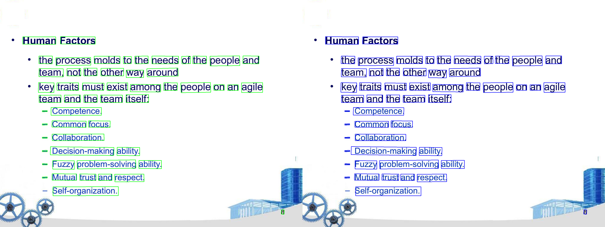

<table class="sphinxhide" width="100%">
 <tr width="100%">
    <td align="center"><h1> Ryzen™ AI Nemotron OCR v2 on Ryzen AI NPU </h1>
    </td>
 </tr>
</table>

# Nemotron OCR v2 on Ryzen AI NPU

This project demonstrates running [NVIDIA's Nemotron OCR v2](https://huggingface.co/nvidia/nemotron-ocr-v2) models on AMD Ryzen AI NPUs using BF16 precision. The repository provides:

- **ONNX model export** from PyTorch to static-shape ONNX format
- **NPU compilation** via AMD Vitis AI with BF16 quantization
- **Inference testing** comparing CPU vs NPU performance
- **Visualization tools** for detection results

Ryzen AI provides seamless support for deploying FP32 models on NPU hardware through automatic conversion to BFLOAT16 (BF16) format during compilation by the VitisAI Execution Provider.

## Overview

The NVIDIA Nemotron OCR v2 pipeline consists of three models:

| Model | Purpose |
|-------|---------|
| **Detector** | Locates text regions in images |
| **Recognizer** | Extracts text from detected regions |
| **Relational** | Handles relational text understanding |

This repository provides utilities to run these models on AMD Ryzen AI NPUs using:

- **AMD Vitis AI** for NPU compilation and inference

## Requirements

### Hardware & Software

- **AMD Ryzen AI processor** with NPU support
- **Windows 11**
- **Visual Studio 2022**
- **CMake** version >= 3.26
- **Python** distribution (Miniforge recommended)

### AMD Ryzen AI Environment

- **AMD Ryzen AI 1.7.1** conda environment required
- Installation guide: https://ryzenai.docs.amd.com/en/latest/inst.html

## Quick Start

### 1. Clone Repository

```bash
git lfs install
git clone https://github.com/amd/RyzenAI-SW.git
cd RyzenAI-SW\CNN-examples\Nemotron-OCR-V2
```

### 2. Obtain the Models

The ONNX models are readily available for testing in the **[Models](Models/)** folder. However, if you want to convert the models from the original Hugging Face PyTorch versions, you can follow the steps below.

#### 2.1 Get the Nemotron OCR V2 repository from Huggingface

```bash
git lfs install
git clone https://huggingface.co/nvidia/nemotron-ocr-v2
```

#### 2.2 Create a Conda environment with the dependencies

```bash
conda create -n nemotron_export python=3.12 pytorch cpuonly -c pytorch -c conda-forge
conda activate nemotron_export
pip install "onnx>=1.16,<1.20" "onnxruntime>=1.18" "torchvision>=0.19"
```

#### 2.3 Exporting the ONNX models

```bash
python export_onnx.py --model-dir ./nemotron-ocr-v2 --output-dir ./Models
```

This produces 3 ONNX models in the `Models/` directory:

```bash
Models/
  nvidia-nemotron-ocr-v2-detector-english/
    nvidia-nemotron-ocr-v2-detector-english_1x3x1024x1024.onnx       # ~130 KB
    nvidia-nemotron-ocr-v2-detector-english_1x3x1024x1024.data       # ~173 MB
  nvidia-nemotron-ocr-v2-recognizer-english/
    nvidia-nemotron-ocr-v2-recognizer-english_1x128x8x32.onnx        # ~64 KB
    nvidia-nemotron-ocr-v2-recognizer-english_1x128x8x32.data        # ~24 MB
  nvidia-nemotron-ocr-v2-relational-english/
    nvidia-nemotron-ocr-v2-relational-english_128x128x2x3.onnx       # ~235 KB
    nvidia-nemotron-ocr-v2-relational-english_128x128x2x3.data       # ~8.6 MB
```

Each `.onnx` file contains the computation graph, while the `.data` file contains the weights. Both files must remain in the same directory.

The script validates each model after export by comparing outputs from PyTorch and ONNX Runtime, and prints PASS/FAIL for each exported model. After a successful export, you should see:

```bash
All exports PASSED validation.
```

#### Exported model shapes

All shapes are static (no dynamic axes).

| Model | Inputs | Outputs |
|---|---|---|
| **Detector** | `input` `[1, 3, 1024, 1024]` fp32 | `confidence` `[1, 256, 256]`, `rboxes` `[1, 256, 256, 5]`, `features` `[1, 128, 256, 256]` |
| **Recognizer** | `input` `[1, 128, 8, 32]` fp32 | `logits` `[1, 32, 858]`, `features` `[1, 32, 256]` |
| **Relational** | `rectified_quads` `[128, 128, 2, 3]`, `original_quads` `[128, 4, 2]`, `recog_features` `[128, 32, 256]` fp32 | `null_logits` `[128, 3]`, `neighbor_logits` `[128, 15, 3]`, `neighbor_indices` `[128, 15]` int64 |

### 3. Activate AMD Ryzen AI Environment

```bash
conda activate ryzen-ai-1.7.1
```

### 4. Model Compilation - [BF16](https://ryzenai.docs.amd.com/en/latest/modelrun.html#using-bf16-models)

**Requirements:**

- A [vitisai_config.json](vitisai_config.json) configuration file is required for BF16 model compilation.
- The optional `--benchmark` flag runs the compiled model on dummy input to measure performance on the NPU

The compile script creates a cache in the specified `cache-dir`, within a cache key folder. This cache is later used when running the model on the NPU. Depending on the model size and hardware, BF16 compilation may take some time to complete.

#### Compile Detector Model

```bash
python compile_npu.py \
  "Models\nvidia-nemotron-ocr-v2-detector-english\nvidia-nemotron-ocr-v2-detector-english_1x3x1024x1024.onnx" \
  --vai-config vitisai_config.json \
  --benchmark
```

### 5. Test Detector on NPU

The testing script accepts the base ONNX model, an input image, and the VAI configuration file. It loads the previously compiled cache using a cache key derived from the model name.

The default detection threshold is set to `0.7`. You can modify it using `--detection-threshold` and `--npu-threshold` (for NPU-specific tuning). Enabling the `--visualize` flag will overlay detections on the test image and save the results to the default `detection_results` folder, allowing comparison between CPU and NPU outputs.

```bash
python test_detector_npu.py \
  "Models\nvidia-nemotron-ocr-v2-detector-english\nvidia-nemotron-ocr-v2-detector-english_1x3x1024x1024.onnx" \
  --image_path "Images\test\test.jpg" \
  --vai-config vitisai_config.json \
  --visualize
```

<p align="center">
  
  <br/>
  <em>CPU-FP32 vs NPU-BF16</em>
</p>

### 6. End to End Pipeline: Combining Detector, Recognizer, and Relational models

Let's first compile the Recognizer and Relational models into BF16, and then test them end-to-end by creating a pipeline that takes inputs from the Detector model.

#### Compile Recognizer Model

```bash
python compile_npu.py \
  "Models\nvidia-nemotron-ocr-v2-recognizer-english\nvidia-nemotron-ocr-v2-recognizer-english_1x128x8x32.onnx" \
  --vai-config vitisai_config.json \
  --benchmark
```

#### Compile Relational Model

```bash
python compile_npu.py \
  "Models\nvidia-nemotron-ocr-v2-relational-english\nvidia-nemotron-ocr-v2-relational-english_128x128x2x3.onnx" \
  --vai-config vitisai_config.json \
  --benchmark
```

## License

The NVIDIA Nemotron OCR v2 models are licensed under the [NVIDIA Open Model License](https://www.nvidia.com/en-us/agreements/enterprise-software/nvidia-open-model-license/). Please review the license terms before using these models. By using the NVIDIA Nemotron OCR v2 models, you agree to comply with the terms and conditions specified in the NVIDIA Open Model License.
